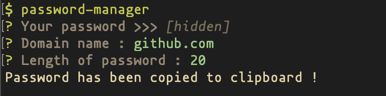

# PasswordManage

### a command-line-based password manager.


## Intro

你只需要记住一个主密码即可，根据不同的域名生成加密后的密码，生成的密码会自动复制到你的剪切板。

You only need to remember a master password. Generate encrypted passwords according to different domain names. The generated passwords will be automatically copied to your clipboard.


## Screenshot




## Installation

```bash
git clone https://github.com/Kuari/PasswordManager.git

cd PasswordManager

npm i

npm link
```


## Usage

```bash
passwordManager
```

